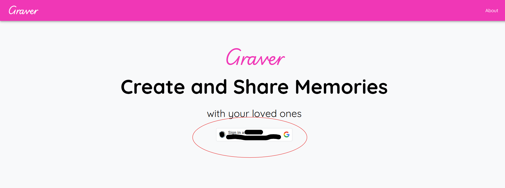
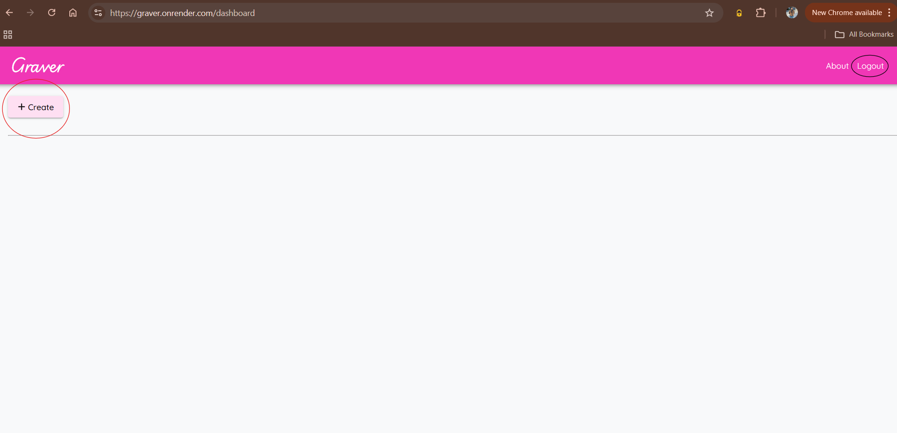
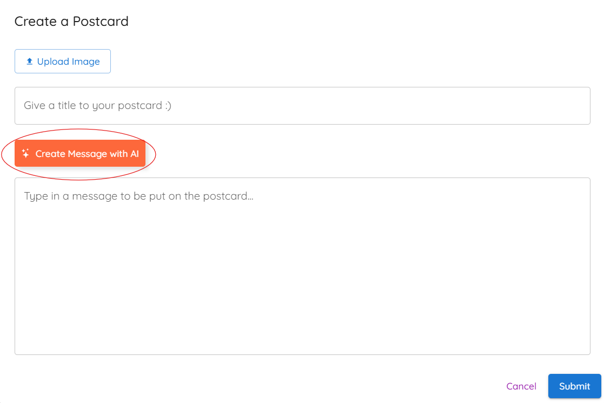
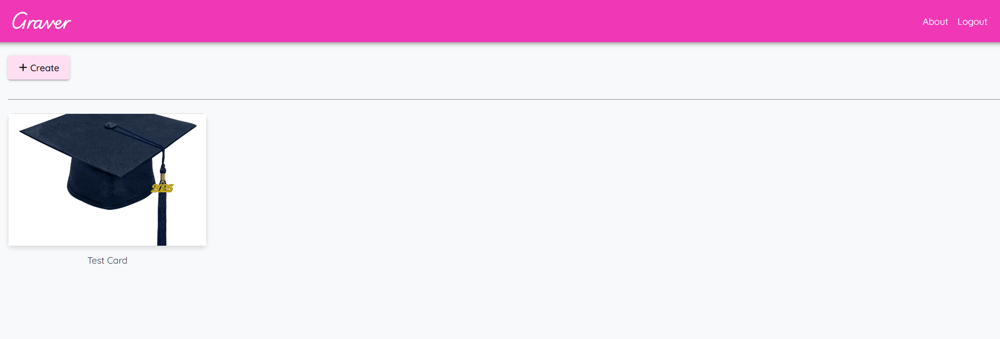
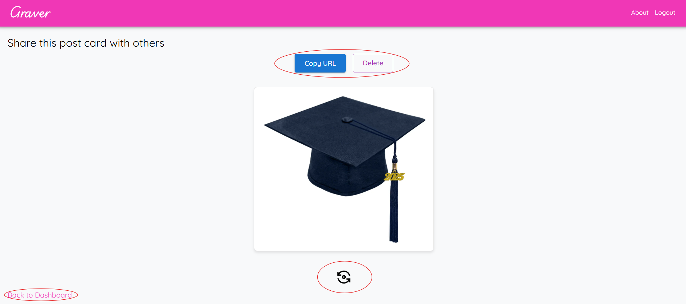

# Graver

This is the UI code repository for Graver - Postcard sharing app. Refer to [Graver Server Repository](https://github.com/Gizmosoft/graver-server) for backend server app code.  

## Tech Stack  


## Project Structure  

```text
📦 graver/
├── 📁 public/                   
├── 📁 src/                      
│   ├── 📁 assets/      
|   |   ├── favicon.ico         
│   ├── 📁 components/          
│   │   ├── About.jsx / About.css
│   │   ├── Dashboard.jsx / Dashboard.css
│   │   ├── GithubCard.jsx / GithubCard.css
│   │   ├── GitHubRepoCard.jsx
│   │   ├── GitHubRepoViewer.jsx
│   │   ├── Home.jsx / Home.css
│   │   ├── Logo.jsx / Logo.css
│   │   ├── Navbar.jsx / Navbar.css
│   │   ├── NavbarLogo.jsx
│   │   ├── Postcard.jsx / Postcard.css
│   │   ├── PostcardImageRefs.jsx
│   │   ├── TestPage.jsx / TestPage.css
│   ├── 📁 pages/                
│   │   ├── PostcardPage.jsx / PostcardPage.css
│   ├── 📁 services/             
│   │   ├── App.jsx / App.css
│   │   ├── index.css
│   │   ├── main.jsx
│   │   └── Theme.jsx
├── .env
├── env.txt                      
├── .gitignore                   
├── eslint.config.js             
├── index.html                   
├── LICENSE                      
├── package.json                 
├── package-lock.json           
├── README.md                    
├── static.json                  
└── vite.config.js            
```

## Installation

- Use `git clone` to clone the [repository](https://github.com/Gizmosoft/graver.git) to your local environment  

```bash
git clone https://github.com/Gizmosoft/graver.git
```

- Ensure you have [Node 22.x](https://nodejs.org/en/download) installed along with [npm package manager](https://docs.npmjs.com/downloading-and-installing-node-js-and-npm)  
- Run the below command to install all the dependencies:  

```bash
npm install
```

- Create a `.env` file in the root directory (where package.json file exists) with all the variables defined. Refer to the `env.txt` file to know about the variables required for the project  
- Run the below command to start the Node.js server in the dev mode:

```bash
npm run dev
```

- Or you can use the below command to start the server:

```bash
npm start
```

## App functionality

  
Users can login to the application using their Google account via the Google OAuth feature  

---
  
This is the Dashboard page where all your created postcards will appear. There is CREATE button which you can use to create a post card. About button takes you to the ABOUT page of the app and LOGOUT button logs user out to the Home page.  

---
  
On clicking CREATE button from the Dashboard page, you'll see this popup where you can upload a picture and write a message to appear on the back of the postcard. Note that, you can generate a postcard message using AI with the `Create Message with AI` button. Once done, click on SUBMIT to create a postcard. Created postcard will appear on the Dashboard page automatically.  

---
  
This is how the dashboard would look after successfully creating a postcard.  

---
  
Use the FLIP button below the image to see the postcard message.  
Copy URL button can be used to get the shareable link for the postcard. This link can be shared with others, who can view this postcard in viewable mode.  
DELETE button can be used to delete the postcard permanently.  
Back to Dashboard button can be used to go back to the Dashboard page.  

## Contributing

Pull requests are welcome. For major changes, please open an issue first
to discuss what you would like to change.

## License

[MIT](https://choosealicense.com/licenses/mit/)
